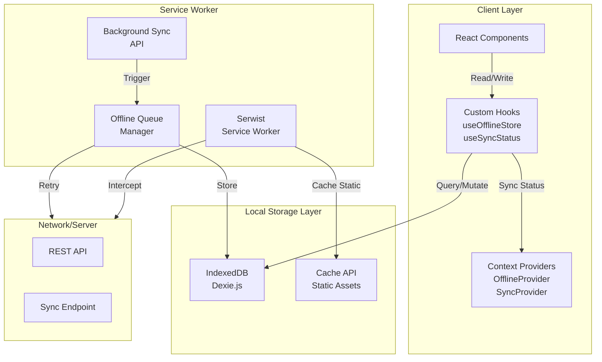

# Offline-First PWA Architecture

Best practices for handling offline functionality in the Store Management PWA.

## Architecture Overview



## Tech Stack

- **IndexedDB**: Dexie.js for structured offline storage
- **Service Worker**: Serwist for caching and background sync
- **State Management**: Zustand + dexie-react-hooks for reactive queries

---

## 1. Database Schema (Dexie.js)

```typescript
// lib/offline/db.ts
import Dexie, { Table } from 'dexie';

export interface Sale {
  id: string;
  storeId: string;
  timestamp: number;
  items: SaleItem[];
  total: number;
  paymentMethod: 'cash' | 'card';
  syncStatus: 'pending' | 'synced' | 'failed';
  syncedAt?: number;
  notes?: string;
}

export interface SaleItem {
  productId: string;
  productName: string;
  quantity: number;
  unitPrice: number;
  discount?: number;
}

export interface InventoryItem {
  id: string;
  storeId: string;
  productId: string;
  productName: string;
  sku: string;
  quantity: number;
  lastUpdated: number;
  syncStatus: 'pending' | 'synced' | 'failed';
}

export interface SyncLog {
  id: string;
  timestamp: number;
  type: 'sale' | 'inventory' | 'full-sync';
  status: 'pending' | 'success' | 'failed';
  recordId?: string;
  error?: string;
}

export interface OfflineQueue {
  id: string;
  operation: 'create' | 'update' | 'delete';
  entity: 'sale' | 'inventory';
  data: any;
  timestamp: number;
  retryCount: number;
  maxRetries: number;
  lastError?: string;
}

export class RetailDB extends Dexie {
  sales!: Table<Sale>;
  inventoryItems!: Table<InventoryItem>;
  syncLogs!: Table<SyncLog>;
  offlineQueue!: Table<OfflineQueue>;

  constructor() {
    super('retail-store-db');
    this.version(1).stores({
      sales: '++id, storeId, timestamp, syncStatus',
      inventoryItems: '++id, storeId, productId, syncStatus',
      syncLogs: '++id, timestamp, type, status',
      offlineQueue: '++id, timestamp, entity, retryCount',
    });
  }
}

export const db = new RetailDB();
```

---

## 2. Custom Hooks

### useOfflineStore Hook

```typescript
// lib/hooks/useOfflineStore.ts
import { useLiveQuery } from 'dexie-react-hooks';
import { db, Sale, InventoryItem } from '@/lib/offline/db';
import { v4 as uuidv4 } from 'uuid';

interface UseOfflineStoreReturn {
  sales: Sale[] | undefined;
  inventory: InventoryItem[] | undefined;
  isLoading: boolean;
  addSale: (sale: Omit<Sale, 'id' | 'timestamp' | 'syncStatus'>) => Promise<string>;
  updateInventory: (item: InventoryItem) => Promise<void>;
  getPendingSales: () => Promise<Sale[]>;
  getPendingInventory: () => Promise<InventoryItem[]>;
}

export const useOfflineStore = (storeId: string): UseOfflineStoreReturn => {
  const sales = useLiveQuery(
    () => db.sales.where('storeId').equals(storeId).toArray(),
    [storeId]
  );

  const inventory = useLiveQuery(
    () => db.inventoryItems.where('storeId').equals(storeId).toArray(),
    [storeId]
  );

  const addSale = async (
    sale: Omit<Sale, 'id' | 'timestamp' | 'syncStatus'>
  ): Promise<string> => {
    const id = uuidv4();
    const newSale: Sale = {
      ...sale,
      id,
      timestamp: Date.now(),
      syncStatus: 'pending',
    };

    try {
      await db.sales.add(newSale);

      await db.offlineQueue.add({
        id: uuidv4(),
        operation: 'create',
        entity: 'sale',
        data: newSale,
        timestamp: Date.now(),
        retryCount: 0,
        maxRetries: 5,
      });

      if ('serviceWorker' in navigator && 'SyncManager' in window) {
        const registration = await navigator.serviceWorker.ready;
        await (registration as any).sync.register('sync-sales');
      }

      return id;
    } catch (error) {
      console.error('Failed to add sale:', error);
      await db.syncLogs.add({
        id: uuidv4(),
        timestamp: Date.now(),
        type: 'sale',
        status: 'failed',
        recordId: id,
        error: String(error),
      });
      throw error;
    }
  };

  const updateInventory = async (item: InventoryItem) => {
    try {
      await db.inventoryItems.put({
        ...item,
        syncStatus: 'pending',
      });

      await db.offlineQueue.add({
        id: uuidv4(),
        operation: 'update',
        entity: 'inventory',
        data: item,
        timestamp: Date.now(),
        retryCount: 0,
        maxRetries: 3,
      });
    } catch (error) {
      console.error('Failed to update inventory:', error);
      throw error;
    }
  };

  const getPendingSales = () => 
    db.sales.where('syncStatus').equals('pending').toArray();
  
  const getPendingInventory = () =>
    db.inventoryItems.where('syncStatus').equals('pending').toArray();

  return {
    sales,
    inventory,
    isLoading: sales === undefined || inventory === undefined,
    addSale,
    updateInventory,
    getPendingSales,
    getPendingInventory,
  };
};
```

### useSyncStatus Hook

```typescript
// lib/hooks/useSyncStatus.ts
import { useEffect, useState } from 'react';
import { db } from '@/lib/offline/db';

interface SyncStatus {
  isOnline: boolean;
  isSyncing: boolean;
  pendingCount: number;
  lastSyncTime?: number;
  syncError?: string;
}

export const useSyncStatus = (): SyncStatus => {
  const [syncStatus, setSyncStatus] = useState<SyncStatus>({
    isOnline: typeof navigator !== 'undefined' ? navigator.onLine : true,
    isSyncing: false,
    pendingCount: 0,
  });

  useEffect(() => {
    let isMounted = true;

    const handleOnline = () => {
      if (isMounted) setSyncStatus(prev => ({ ...prev, isOnline: true }));
      triggerSync();
    };

    const handleOffline = () => {
      if (isMounted) setSyncStatus(prev => ({ ...prev, isOnline: false }));
    };

    const checkPendingCount = async () => {
      const count = await db.offlineQueue.where('retryCount').belowOrEqual(5).count();
      if (isMounted) setSyncStatus(prev => ({ ...prev, pendingCount: count }));
    };

    window.addEventListener('online', handleOnline);
    window.addEventListener('offline', handleOffline);

    const interval = setInterval(checkPendingCount, 5000);
    checkPendingCount();

    const triggerSync = async () => {
      if ('serviceWorker' in navigator && 'SyncManager' in window) {
        try {
          const registration = await navigator.serviceWorker.ready;
          await (registration as any).sync.register('sync-sales');
        } catch (error) {
          console.warn('Background sync not available:', error);
        }
      }
    };

    return () => {
      isMounted = false;
      window.removeEventListener('online', handleOnline);
      window.removeEventListener('offline', handleOffline);
      clearInterval(interval);
    };
  }, []);

  return syncStatus;
};
```

---

## 3. Context Provider

```typescript
// lib/contexts/OfflineContext.tsx
'use client';

import React, { createContext, useContext, ReactNode } from 'react';
import { useSyncStatus } from '@/lib/hooks/useSyncStatus';

interface OfflineContextType {
  isOnline: boolean;
  isSyncing: boolean;
  pendingCount: number;
  lastSyncTime?: number;
  syncError?: string;
}

const OfflineContext = createContext<OfflineContextType | undefined>(undefined);

export const OfflineProvider: React.FC<{ children: ReactNode }> = ({ children }) => {
  const syncStatus = useSyncStatus();

  return (
    <OfflineContext.Provider value={syncStatus}>
      {children}
    </OfflineContext.Provider>
  );
};

export const useOffline = (): OfflineContextType => {
  const context = useContext(OfflineContext);
  if (!context) {
    throw new Error('useOffline must be used within OfflineProvider');
  }
  return context;
};
```

---

## 4. Service Worker (Serwist)

### Configuration

```typescript
// next.config.js
import withSerwistInit from '@serwist/next';

const withSerwist = withSerwistInit({
  swSrc: 'app/sw.ts',
  swDest: 'public/sw.js',
  cacheOnFrontEndNav: true,
  reloadOnOnline: true,
});

export default withSerwist({
  reactStrictMode: true,
});
```

### Service Worker Implementation

```typescript
// app/sw.ts
import { defaultCache } from '@serwist/next/worker';
import type { PrecacheEntry, SerwistGlobalConfig } from 'serwist';
import { Serwist } from 'serwist';

declare global {
  interface WorkerGlobalScope extends SerwistGlobalConfig {
    __SW_MANIFEST: (PrecacheEntry | string)[] | undefined;
  }
}

declare const self: ServiceWorkerGlobalScope;

const serwist = new Serwist({
  precacheEntries: self.__SW_MANIFEST,
  skipWaiting: true,
  clientsClaim: true,
  navigationPreload: true,
  runtimeCaching: defaultCache,
});

// Background Sync Handler
self.addEventListener('sync', (event: any) => {
  if (event.tag === 'sync-sales') {
    event.waitUntil(syncPendingData());
  }
});

async function syncPendingData() {
  const dbRequest = indexedDB.open('retail-store-db');
  
  return new Promise((resolve, reject) => {
    dbRequest.onsuccess = async () => {
      const database = dbRequest.result;
      const transaction = database.transaction('offlineQueue', 'readonly');
      const store = transaction.objectStore('offlineQueue');
      const allRecords = store.getAll();

      allRecords.onsuccess = async () => {
        const records = allRecords.result;
        
        for (const record of records) {
          try {
            const response = await fetch(`/api/sync/${record.entity}`, {
              method: 'POST',
              headers: { 'Content-Type': 'application/json' },
              body: JSON.stringify(record.data),
            });

            if (response.ok) {
              const deleteTransaction = database.transaction('offlineQueue', 'readwrite');
              deleteTransaction.objectStore('offlineQueue').delete(record.id);
            }
          } catch (error) {
            console.error('Sync failed for record:', record.id, error);
          }
        }
        resolve(true);
      };

      allRecords.onerror = () => reject(allRecords.error);
    };

    dbRequest.onerror = () => reject(dbRequest.error);
  });
}

serwist.addEventListeners();
```

---

## 5. UI Components

### Offline Indicator

```typescript
// components/mobile/OfflineIndicator.tsx
'use client';

import { useOffline } from '@/lib/contexts/OfflineContext';
import { Wifi, WifiOff, RefreshCw } from 'lucide-react';

export const OfflineIndicator: React.FC = () => {
  const { isOnline, isSyncing, pendingCount } = useOffline();

  if (isOnline && !isSyncing && pendingCount === 0) {
    return null;
  }

  return (
    <div className="fixed bottom-4 right-4 p-3 rounded-lg shadow-lg bg-white border">
      <div className="flex items-center gap-2">
        {isOnline ? (
          <Wifi className="h-4 w-4 text-green-500" />
        ) : (
          <WifiOff className="h-4 w-4 text-red-500" />
        )}
        <div>
          <p className="font-semibold text-sm">
            {isOnline ? 'Online' : 'Offline Mode'}
          </p>
          {pendingCount > 0 && (
            <p className="text-xs text-gray-600 flex items-center gap-1">
              {isSyncing && <RefreshCw className="h-3 w-3 animate-spin" />}
              {isSyncing ? `Syncing ${pendingCount} items...` : `${pendingCount} pending`}
            </p>
          )}
        </div>
      </div>
    </div>
  );
};
```

### Sale Form with Offline Support

```typescript
// components/pos/SaleForm.tsx
'use client';

import { useState } from 'react';
import { useOfflineStore } from '@/lib/hooks/useOfflineStore';
import { useOffline } from '@/lib/contexts/OfflineContext';
import { Button } from '@/components/ui/button';
import { formatCurrency } from '@/lib/utils';

interface CartItem {
  productId: string;
  productName: string;
  quantity: number;
  unitPrice: number;
}

export const SaleForm: React.FC<{ storeId: string }> = ({ storeId }) => {
  const { addSale } = useOfflineStore(storeId);
  const { isOnline, pendingCount } = useOffline();
  const [cartItems, setCartItems] = useState<CartItem[]>([]);
  const [isSubmitting, setIsSubmitting] = useState(false);

  const total = cartItems.reduce(
    (sum, item) => sum + item.quantity * item.unitPrice,
    0
  );

  const handleCompleteSale = async () => {
    if (cartItems.length === 0) return;
    
    setIsSubmitting(true);
    try {
      await addSale({
        storeId,
        items: cartItems,
        total,
        paymentMethod: 'cash',
      });

      setCartItems([]);
    } catch (error) {
      console.error('Sale failed:', error);
    } finally {
      setIsSubmitting(false);
    }
  };

  return (
    <div className="p-4">
      {/* Online/Offline Status */}
      <div className={`mb-4 p-2 rounded ${isOnline ? 'bg-green-50' : 'bg-orange-50'}`}>
        <p className="text-sm font-medium">
          {isOnline ? '🟢 Online' : '🔴 Offline - Sales will sync when back online'}
        </p>
        {pendingCount > 0 && (
          <p className="text-xs text-orange-600">
            {pendingCount} transactions pending sync
          </p>
        )}
      </div>

      {/* Cart Items */}
      <div className="mb-4 space-y-2">
        {cartItems.map((item, idx) => (
          <div key={idx} className="flex justify-between text-sm border-b pb-2">
            <span>{item.productName} x{item.quantity}</span>
            <span>{formatCurrency(item.quantity * item.unitPrice)}</span>
          </div>
        ))}
      </div>

      {/* Total */}
      <div className="flex justify-between font-bold text-lg mb-4">
        <span>Total</span>
        <span>{formatCurrency(total)}</span>
      </div>

      {/* Complete Sale Button */}
      <Button
        onClick={handleCompleteSale}
        disabled={cartItems.length === 0 || isSubmitting}
        className="w-full"
      >
        {isSubmitting ? 'Processing...' : 'Complete Sale'}
      </Button>
    </div>
  );
};
```

---

## 6. Sync API Endpoint

```typescript
// app/api/sync/sales/route.ts
import { NextRequest, NextResponse } from 'next/server';
import { createClient } from '@/lib/supabase/server';

export async function POST(request: NextRequest) {
  try {
    const supabase = createClient();
    const sale = await request.json();

    const { data, error } = await supabase
      .from('sales')
      .upsert(sale, { onConflict: 'id' })
      .select()
      .single();

    if (error) {
      return NextResponse.json({ error: error.message }, { status: 500 });
    }

    return NextResponse.json({
      success: true,
      data,
      timestamp: new Date().toISOString(),
    });
  } catch (error) {
    console.error('Sync error:', error);
    return NextResponse.json({ error: 'Sync failed' }, { status: 500 });
  }
}
```

---

## 7. Best Practices Summary

| Aspect | Best Practice |
|--------|---------------|
| **Data Schema** | Use Dexie tables with indexes for `syncStatus`, `storeId`, `timestamp` |
| **Offline Operations** | Queue operations in `offlineQueue` table with retry logic |
| **React Hooks** | Use `useLiveQuery` from dexie-react-hooks for reactive UI |
| **Sync Strategy** | Background sync with exponential backoff for retries |
| **Conflict Resolution** | Use `lastModified` timestamps, implement last-write-wins |
| **UI Feedback** | Show offline status, sync progress, pending counts |
| **Cache Strategy** | Network-first for API, cache-first for static assets |
| **Error Handling** | Log failures to `syncLogs` table for debugging |
| **Data Validation** | Validate with Zod before storing and syncing |

---

## 8. Implementation Checklist

- [ ] Set up Dexie.js database schema
- [ ] Create `useOfflineStore` hook
- [ ] Create `useSyncStatus` hook
- [ ] Implement `OfflineProvider` context
- [ ] Configure Serwist service worker
- [ ] Add background sync handler
- [ ] Create `OfflineIndicator` component
- [ ] Update POS components to use offline hooks
- [ ] Create sync API endpoints
- [ ] Add conflict resolution logic
- [ ] Test offline/online transitions
- [ ] Test data sync after reconnection

---

## 9. Testing Offline Mode

### Chrome DevTools
1. Open DevTools → Network tab
2. Select "Offline" from throttling dropdown
3. Perform actions and verify they're queued
4. Go back online and verify sync

### Service Worker Testing
1. Open DevTools → Application → Service Workers
2. Check "Offline" checkbox
3. Verify cached resources load
4. Check Background Sync in "Sync" section

---

## Related Documentation

- [Dexie.js Documentation](https://dexie.org/docs/)
- [Serwist Documentation](https://serwist.pages.dev/)
- [Background Sync API](https://developer.mozilla.org/en-US/docs/Web/API/Background_Synchronization_API)
- [IndexedDB Best Practices](https://web.dev/indexeddb-best-practices/)
